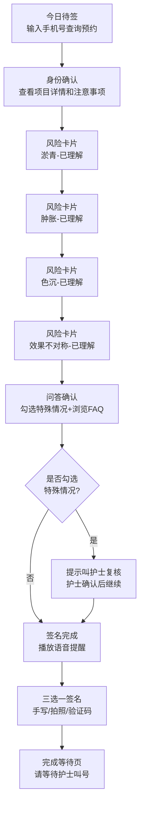

## 1. 产品概述

医美术前知情同意签署台，安装在咨询室平板上，专为第一次到院、对医美流程不熟悉的顾客设计。通过分步引导、大字号展示、语音提醒等方式，降低顾客焦虑，提高签署效率，减少护士重复答疑工作量。

## 2. 核心功能

### 2.1 用户角色

| 角色 | 使用方式 | 核心权限 |
|------|----------|----------|
| 医美顾客 | 平板端操作 | 查看预约、阅读风险、签署同意书 |
| 护士 | 辅助操作 | 复核特殊情况、确认签名完成 |

### 2.2 功能模块

1. **今日待签页**：手机号输入、预约项目查询、操作医生信息展示
2. **身份确认页**：大字号项目详情、部位、麻醉方式、恢复期注意事项
3. **风险卡片页**：单屏单风险点（淤青、肿胀、色沉、效果不对称），逐页理解确认
4. **问答确认页**：特殊情况勾选（孕期/瘢痕体质/近期服药）、常见问题FAQ
5. **签名完成页**：30秒语音提醒、手写签名/拍照确认/短信验证码、等待叫号提示

### 2.3 页面详情

| 页面名称 | 模块名称 | 功能描述 |
|----------|----------|----------|
| 今日待签 | 手机号输入 | 11位手机号格式校验、虚拟数字键盘适配平板 |
| 今日待签 | 预约信息卡片 | 展示项目名称、预约时间、预计操作医生头像及姓名 |
| 身份确认 | 项目详情大字展示 | 超大字号项目名、部位标签、麻醉方式、恢复期日历 |
| 身份确认 | 注意事项列表 | 术前术后禁忌事项，图标+文字双列展示 |
| 风险卡片 | 风险点逐页展示 | 每页一个风险，配示意图、发生概率、持续时间、应对方法 |
| 风险卡片 | 已理解按钮 | 必须点击才能进入下一页，防止跳过 |
| 风险卡片 | 进度指示器 | 显示当前第几个风险，共几个 |
| 问答确认 | 特殊情况勾选 | 孕期/哺乳期/瘢痕体质/近期服药/过敏史，勾选后弹窗提示叫护士 |
| 问答确认 | 常见问题FAQ | 可展开收起：能否化妆、多久碰水、是否影响上班、饮食禁忌 |
| 签名完成 | 语音提醒播放器 | 30秒语音播报关键风险，带进度条和重播按钮 |
| 签名完成 | 多种签名方式 | 手写签名板、拍照上传身份证/照片、短信验证码确认 |
| 签名完成 | 完成等待页 | 大号提示"请等待护士叫号"，取号编号展示，无需顾客操作 |

## 3. 核心流程

顾客从咨询室护士手中接过平板，输入手机号查询今日预约 → 确认项目信息和注意事项 → 逐页阅读4个风险点并逐一点击理解 → 勾选自身特殊情况（如有则叫护士）、浏览常见问题 → 听完语音提醒后完成签名（手写/拍照/验证码三选一） → 显示等待提示，平板交还给护士。

## 4. 用户界面设计

### 4.1 设计风格

- **主色调**：柔和暖白 #FFFBF7 背景 + 玫瑰粉 #E8B4B8 主色 + 深墨灰 #2D2A32 文字
- **辅助色**：薄荷绿 #A8D5BA 用于确认/安全提示，琥珀橙 #F5C77E 用于警告/注意
- **按钮风格**：大圆角胶囊形（border-radius: 999px），最小高度56px适配触控，主按钮渐变色
- **字体**：标题用"思源黑体 Heavy"，正文用"思源黑体 Regular"，超大字号（项目名48px，关键信息32px）
- **布局风格**：卡片式布局，单屏单重点，大量留白减少压迫感，页面间采用横向滑动过渡动画
- **图标风格**：线性圆角图标（线宽2px，圆角8px），避免尖锐感

### 4.2 页面设计概览

| 页面名称 | 模块名称 | UI元素 |
|----------|----------|----------|
| 今日待签 | 顶部品牌区 | Logo+"您好，欢迎来到XX医美"+今日日期 |
| 今日待签 | 手机号输入区 | 居中大号输入框+虚拟数字键盘+查询按钮 |
| 今日待签 | 预约卡片 | 头像卡片样式，医生信息+项目标签+开始按钮 |
| 身份确认 | 项目标题区 | 超大号项目名+部位/麻醉方式标签组 |
| 身份确认 | 恢复期时间轴 | 水平时间轴显示Day0-Day7关键节点 |
| 身份确认 | 注意事项网格 | 2xN图标卡片网格，每项配图标+标题+说明 |
| 风险卡片 | 全屏风险卡 | 居中示意图+大字号风险名称+概率/时长徽章+应对说明 |
| 风险卡片 | 底部操作区 | 左：进度点指示器 中/右：已理解胶囊按钮（闪烁提示） |
| 问答确认 | 特殊情况区 | 复选框列表，勾选时卡片边框变色+提示条 |
| 问答确认 | FAQ折叠区 | 手风琴折叠，每项展开显示详细解答 |
| 签名完成 | 语音播放区 | 圆形播放按钮+进度条+剩余秒数+重播 |
| 签名完成 | 签名三选项卡 | Tab切换手写/拍照/验证码，各带独立操作区 |
| 签名完成 | 完成等待页 | 居中大号对勾动画+"请等待护士叫号"+取号编号闪烁 |

### 4.3 响应式

- **平板优先设计**：基准分辨率 1280×800（横屏），适配 1024×768 ~ 1920×1200
- **触控优化**：所有可点击元素最小尺寸 48×48dp，主要按钮 56dp 高度
- **大触控区**：手指点击区域比视觉区域大20%，避免误触
- **横屏锁定**：应用强制横屏，布局左右分栏，适配平板使用场景
