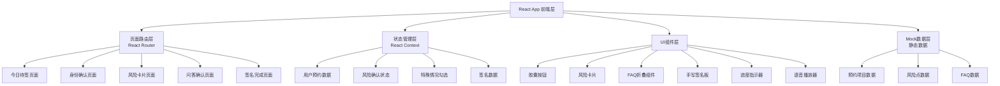

## 1. 架构设计



## 2. 技术描述

- **前端框架**：React@18 + TypeScript@5
- **构建工具**：Vite@5
- **样式方案**：TailwindCSS@3 + CSS变量主题系统
- **路由管理**：React Router DOM@6（HashRouter适配平板本地运行）
- **状态管理**：React Context + useReducer（轻量级，避免过度工程化）
- **图标库**：Lucide React（线性圆角图标，符合设计风格）
- **手写签名**：react-signature-canvas
- **动画库**：Framer Motion（页面过渡、微交互动画）
- **后端**：无后端，使用静态Mock数据模拟预约查询
- **数据存储**：localStorage存储签署流程状态（防止误操作丢失进度）

## 3. 路由定义

| 路由 | 页面组件 | 用途 |
|------|----------|------|
| / | TodaySignPage | 今日待签 - 手机号输入、预约查询 |
| /identity | IdentityPage | 身份确认 - 项目详情、注意事项 |
| /risks | RisksPage | 风险卡片 - 4个风险点逐页确认 |
| /qa | QAPage | 问答确认 - 特殊情况勾选、FAQ |
| /sign | SignPage | 签名完成 - 语音提醒、三种签名方式、完成等待 |

## 4. 核心数据模型

### 4.1 TypeScript类型定义

```typescript
// 预约信息
interface Appointment {
  id: string;
  phone: string;
  patientName: string;
  projectName: string;
  projectCode: string;
  bodyPart: string;
  anesthesiaType: 'none' | 'surface' | 'local' | 'general';
  recoveryDays: number;
  appointmentTime: string;
  doctor: {
    name: string;
    title: string;
    avatar: string;
  };
  precautions: Precaution[];
}

// 注意事项
interface Precaution {
  id: string;
  icon: string;
  title: string;
  description: string;
  type: 'before' | 'after';
}

// 风险点
interface RiskPoint {
  id: string;
  title: string;
  description: string;
  probability: '高' | '中' | '低';
  duration: string;
  solution: string;
  illustration: string;
}

// 特殊情况
interface SpecialCondition {
  id: string;
  label: string;
  checked: boolean;
  needNurseReview: boolean;
}

// FAQ
interface FAQItem {
  id: string;
  question: string;
  answer: string;
  expanded: boolean;
}

// 签署流程状态
interface SignFlowState {
  phone: string;
  appointment: Appointment | null;
  understoodRisks: string[];
  specialConditions: SpecialCondition[];
  voiceCompleted: boolean;
  signMethod: 'handwrite' | 'photo' | 'sms' | null;
  signData: string | null;
  smsVerified: boolean;
  completed: boolean;
  queueNumber: string;
}
```

### 4.2 Mock数据预置

- 预约项目：玻尿酸填充、水光针、热玛吉、光子嫩肤等常见项目各1套
- 测试手机号：13800138000（返回预约数据），其他号码显示"暂无预约"提示
- 风险点4个：淤青、肿胀、色素沉着、效果不对称（各含完整描述、概率、应对方案）
- FAQ 6条：化妆、碰水、上班、饮食、运动、复查时间
- 恢复期时间轴节点：Day0(手术日)、Day1(红肿期)、Day3(消肿期)、Day7(初步恢复)

## 5. 组件目录结构

```
src/
├── contexts/
│   └── SignFlowContext.tsx      # 签署流程全局状态
├── data/
│   ├── mockAppointments.ts      # 预约Mock数据
│   ├── mockRisks.ts             # 风险点数据
│   └── mockFAQs.ts              # FAQ数据
├── pages/
│   ├── TodaySignPage.tsx        # 今日待签
│   ├── IdentityPage.tsx         # 身份确认
│   ├── RisksPage.tsx            # 风险卡片
│   ├── QAPage.tsx               # 问答确认
│   └── SignPage.tsx             # 签名完成
├── components/
│   ├── ui/
│   │   ├── CapsuleButton.tsx    # 胶囊按钮
│   │   ├── PageHeader.tsx       # 页面顶部导航
│   │   └── ProgressDots.tsx     # 进度指示器
│   ├── PhoneInput.tsx           # 手机号输入+虚拟键盘
│   ├── AppointmentCard.tsx      # 预约信息卡片
│   ├── RecoveryTimeline.tsx     # 恢复期时间轴
│   ├── RiskCard.tsx             # 单个风险卡片
│   ├── SpecialConditionList.tsx # 特殊情况勾选列表
│   ├── FAQAccordion.tsx         # FAQ折叠手风琴
│   ├── VoicePlayer.tsx          # 语音提醒播放器
│   ├── HandwritePad.tsx         # 手写签名板
│   ├── PhotoUploader.tsx        # 拍照/上传组件
│   └── SMSVerify.tsx            # 短信验证码组件
├── hooks/
│   └── useSignFlow.ts           # 流程状态Hook
├── types/
│   └── index.ts                 # 类型定义
├── App.tsx
├── main.tsx
└── index.css
```

## 6. 关键技术实现要点

### 6.1 页面过渡动画
- 使用Framer Motion的AnimatePresence包裹路由
- 前进方向：页面从右向左滑入（x: 100% → x: 0）
- 后退方向：页面从左向右滑入（x: -100% → x: 0）
- 过渡时长300ms，easeOut曲线

### 6.2 手写签名板
- Canvas 2D绘图，支持平板压感（如有）
- 清空、撤销按钮，最小签名面积校验（防止乱涂）
- 签名完成后导出为base64 PNG存入状态

### 6.3 语音提醒
- 使用Web Speech API的SpeechSynthesis模拟30秒语音
- 播放完成后解锁签名按钮，支持中途暂停和重播
- 进度条实时更新，剩余秒数显示

### 6.4 平板适配
- viewport设置：width=device-width, initial-scale=1.0, user-scalable=no
- CSS媒体查询适配1024px~1920px宽度
- 所有触控元素增加:active反馈态（缩放+变色）
- 禁止双指缩放、文本选中、右键菜单
